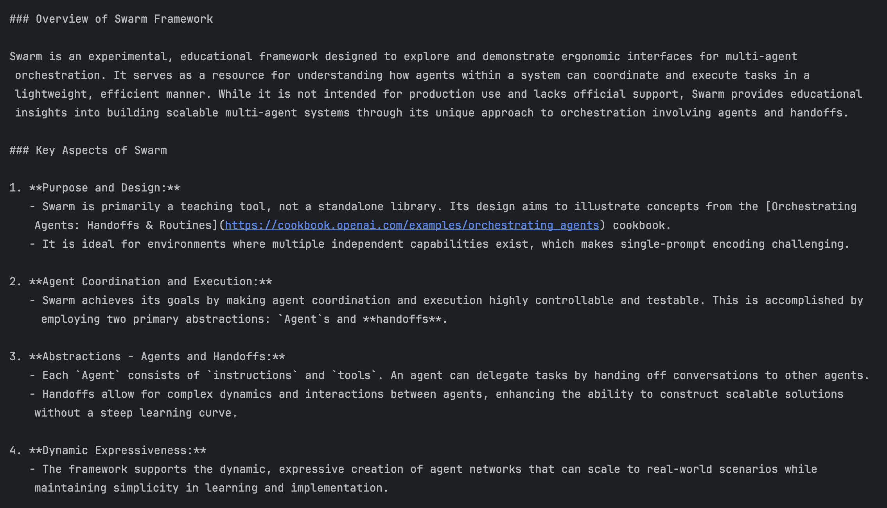
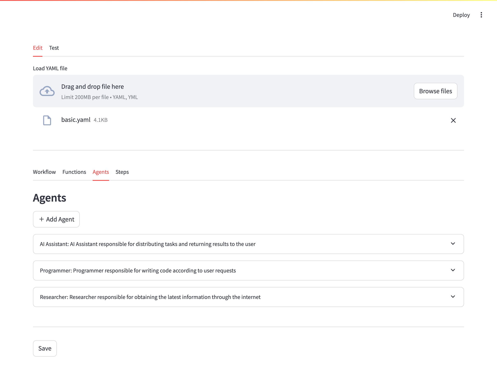
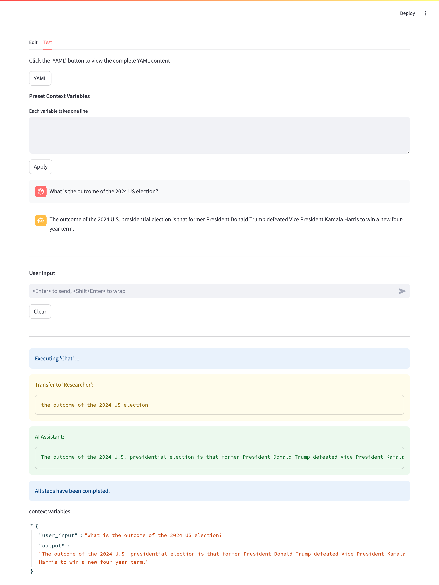

English | [简体中文](./README_cn.md)

# Multi-Agent workflow integrated with Swarm

## 1. Design objectives

1. Decouple product workflows from code logic so that non-developers can independently design and debug workflows.
2. Develop a simple workflow data format to reduce the learning curve for non-developers.
3. Maximize the flexibility of the workflow data format to accommodate a variety of scenarios.

## 2. Main tasks

1. The workflow configuration files adhere to YAML syntax.
2. The workflow configuration files compatible with Jinja2 templates, allowing for control of branches, loops, and variable passing through Jinja2 syntax without modifying code.
3. Integrate Swarm features so that language models within the workflow can autonomously switch agents or call external functions/tools based on user requests.
4. Provide a minimalist UI to facilitate non-developers in configuring and debugging workflows.

## 3. How to use

### 3.1. Preparations

#### 3.1.1. Pull the source code

```shell
git clone https://github.com/x-glacier/SwarmFlow.git
cd SwarmFlow
```

#### 3.1.2. Configure the large language model (LLM)

Edit the configuration file `swarm_flow/config.py`:
- `llm_settings`: Set fields like `base_url`, `api_key`, and `default_model` as needed.
- `rag_settings`：Set fields as needed.
- `tool_settings`: Configure external tools, such as search engine API settings. Use `web_search_proxy` to set up a proxy for the search engine API.

*Note: The `llm_provider` field in the `workflow` section of the workflow configuration file must match a subsection name under `llm_settings` in the `config.py` file (e.g., `openai`).*

#### 3.1.3. Install python dependencies

It's recommended to create and activate a virtual environment using Anaconda3:

```shell
conda create -n swarm_flow python=3.11
conda activate swarm_flow
```

Install the required dependencies:

```shell
pip install -r requirements.txt
```

### 3.2. Running examples

Navigate to the `examples` directory:

```shell
cd examples
```

#### 3.2.1. Multi-turn conversation (with search engine integration)

Run the following command:

```shell
python basic.py
```

The corresponding workflow configuration file for this example is `data/workflows/basic.yaml`.

To test whether the workflow correctly handles time-sensitive information, try asking:
- "What day is it today?"
- "What is the outcome of the 2024 US election?"

Snapshot:


#### 3.2.2. Guided reading of articles

Place the content of the article you want to interpret into `guide_to_reading.txt`, then run:

```shell
python guide_to_reading.py
```

The corresponding workflow configuration file is `data/workflows/guide_to_reading.yaml`.

If you want to view all debugging information, edit `guide_to_reading.py` and set `debug` to `True`.

Snapshot:


#### 3.2.3. Simulated debate competition

Run:

```shell
python debate_competition.py
```

After the program starts, you'll need to input a debate topic, such as:
- "Technology makes life better."
- "Law is more important than morality."

This example simulates a pro and con debate mode. The corresponding workflow configuration file is `data/workflows/debate_competition.yaml`.

Snapshot:


#### 3.2.4. Retrieval-Augmented Generation (RAG)

Run:
```shell
python rag.py
```

The corresponding workflow configuration file for this example is `data/workflows/rag.yaml`.

If you want to verify that the workflow can retrieve the correct information from the knowledge base, try asking: What is CBT?

Snapshot:


### 3.3. Graphical user interface

Running `streamlit run simple_ui.py` will start the `streamlit` service in the background. You can access the UI by visiting `http://localhost:8501` in your browser, making it easier to edit and debug workflows.

**Basic Operations (using the "Article Guided Reading" workflow as an example):**

1. Click the "Browse files" button, select `basic.yaml` from the `data` directory, or drag and drop the file to load it.
2. View or modify the configurations as needed.
3. Switch to the "Test" tab, paste the article content into the "User Input" box, and press Enter.
4. Built-in RAG module, compatible with various embedding methods.
5. Check whether the output meets your expectations.

Snapshot-1:


Snapshot-2:


## 4. Explanation of the workflow YAML file

### 4.1. Basic YAML syntax

- **Case Sensitivity**: YAML is case-sensitive.
- **Indentation**: Use spaces for indentation (typically two or four spaces). Tab characters are not allowed. Elements at the same level should be aligned.
- **Comments**: Use the `#` symbol for comments. Text from `#` to the end of the line is ignored by the parser.

### 4.2. YAML data structures

YAML supports three primary data structures: **scalars**, **arrays**, and **dictionaries**.

- **Scalars**: Represent single, indivisible values. They follow the "key: value" format:

  ```yaml
  key: value
  ```

- **Arrays**: Denoted with `-`, similar to lists in Python. Example:

  ```yaml
  list:
    - item1
    - item2
    - item3
  ```

- **Dictionaries**: Nested combinations of scalars and arrays, akin to Python's `dict`. Example:

  ```yaml
  name: 'John Doe'
  title: 'Sample Text'
  age: 30
  books:
    - 'Java'
    - 'Python'
  ```

### 4.3. Examples

The `data` directory contains several built-in workflow files. Let's look at `basic.yaml` and `debate_competition.yaml` as examples.

#### 4.3.1. `basic.yaml`

```yaml
# Workflow Name and Description (Required Fields)
workflow:
  version: "1.1"
  name: "Multi-turn Q&A"
  description: "A multi-turn Q&A workflow that retrieves information via search engines when needed."
  # The llm_provider must match a subsection name under llm_settings in config.py.
  llm_provider: "openai"

# External Function/Tool Settings (Optional; 'functions' is an array of multiple functions)
functions:
  # ...
  # 'name' is the function name
  - name: transfer_to_agent
    # 'description' explains the function for LLM reasoning
    description: "Transfers the user's request to another agent"
    # Function parameters
    parameters:
      type: object
      properties:
        # 'agent_name' is the first parameter
        agent_name:
          # Parameter description (used for LLM reasoning)
          description: "Transfer to an agent named agent_name"
          # Parameter type
          type: string
          # 'enum' is optional, indicating the parameter is an enumeration type
          enum:
            - "Researcher"
        # 'query' is the second parameter
        query:
          description: "User's request"
          type: string
      # Names of required parameters when calling the function
      required:
        - agent_name
        - query

# Multi-Agent Settings (Required; 'agents' is an array of multiple agents)
agents:
  - name: "AI Assistant"
    # 'description' does not participate in workflow execution; it's for readability
    description: "AI assistant responsible for task distribution and returning results to the user"
    # 'instruction' corresponds to the 'system' role in the OpenAI API's 'messages' parameter; multiline text can be handled using '|'
    instruction: |
      You possess extensive knowledge but lack the latest real-time information. When conversing with users, adhere to the following principles:
      When the user's request contains words like "this year", "recently", "today", or "now", you should transfer it to the `Researcher` to retrieve real-time information.
    # 'functions' includes a list of callable functions.
    functions:
      # The OpenAI API only supports function names in plain English
      - transfer_to_agent

  - name: "Researcher"
    description: "A researcher responsible for obtaining the latest information via the internet"
    instruction: |
      You are an experienced researcher skilled in retrieving the latest information related to the user's request using `web_search`. When handling user requests, adhere to the following principles:
      Prioritize timeliness and accuracy. When the user's request contains words like "this year", "today", "recently," or "now", first obtain the current time using `date`, then incorporate this time into the user's request.
    functions:
      - web_search
      - date

# Workflow Execution Steps (Required)
steps:
  - name: "Chat"
    # 'description' does not participate in workflow execution; it's for readability
    description: "Multi-agent collaboration to handle user requests"
    # If the workflow contains multiple steps, set the execution order using 'order'
    order: 1
    # The agent used in the current step
    agent: "AI Assistant"
    # Set the step's execution mode via 'execution': sync / async
    # 'sync': Synchronous execution; the next step cannot proceed until the current step is complete
    # 'async': Asynchronous execution (multiple steps in parallel); the next step does not need to wait for the previous step to complete
    execution: sync
    # 'output' stores the agent's output result
    output:
      # This variable can be referenced elsewhere by {{ assistant_output }}
      name: assistant_output
      # Supports three output formats: string, list, or json. The default is string.
      type: string
    # If previous steps have 'execution' set to 'async' and the current step depends on their results, list the prerequisite steps in 'prerequisite'
    # Example:
    # prerequisite:
    #   - step1
    #   - step2
    prerequisite: []
```

#### 4.3.2. `debate_competition.yaml` (excerpt)

```yaml
workflow:
  version: "1.1"
  name: "Topic Debate"
  description: "Multi-agent group chat mode where the pro and con sides freely debate the topic."
  llm_provider: "openai"

agents:
  # ...
  - name: "Moderator"
    description: "Responsible for opening remarks and answering participants' questions"
    system: "You are the debate moderator. Your specific job is to facilitate the debate, answer questions directed at you, and decide when to end the debate."
    instruction: |
      You are the debate moderator. Your specific job is to facilitate the debate, answer questions directed at you, and decide when to end the debate.
      Debate Topic: {{ topic }}

      <Conversation Record>
      
      {{ "\n\n".join(conversation[-20:]) }}
      
      </Conversation Record>

      Based on the above conversation record, directly answer questions related to you but do not participate in the debate.
      Please fill in what you want to say into the 'content' field of the following JSON data. Output only the JSON result without any irrelevant information:
      {
        "role": "Moderator",
        "content": <Your words>
      }
    functions: []
  # ...

# Execution Steps
steps:
  # ...
  - name: "Step-2"
    description: "The selected speaker expresses their views or poses questions"
    order: 2
    agent: "{{ active_agent }}"
    execution: sync
    # 'history_length' sets the number of historical conversations retained in 'messages' (corresponding 'role' fields are 'assistant' and 'user')
    history_length: 0
    output:
      name: speech
      type: json
      # `post_processing` is used to process llm output and generat the final output
      post_processing: format_speech_content
      # 'append_to' is optional and used to append the output result to multiple variables for workflow or external code reference
      append_to:
        # Append new content to the 'conversation' variable ('conversation' is of type list)
        - variable: conversation
    prerequisite: []
 ```

In `examples/debate_competition.py`, you can see how external code references the `conversation` variable specified in the `append_to` field, and how to use `post_processing`.

### 4.4. Jinja2 basic syntax

- `{{ }}`: Used to embed expressions or variables.
- ``: Used to embed control statements, such as if statements or for loops.

**`if` Branches:**

```jinja

...

...

...

```

**`for` Loops:**

```jinja

{{ variable }}

```

For examples of how this is applied in workflows, refer to `data/workflows/guide_to_reading.yaml`.

## 5. Future plans

- [X] **Integrate External Knowledge Bases**: Add support for Retrieval-Augmented Generation (RAG) in the workflow.

## 6. Reference

[OpenAI Swarm](https://github.com/openai/swarm)
